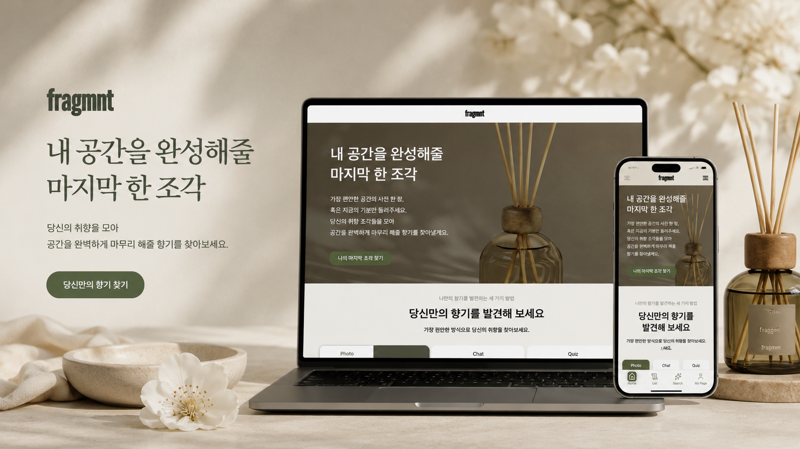

<p align="center">
  
</p>
# Fragmnt

사용자의 취향과 상황에 맞는 향기를 추천하고, 추천 결과를 저장·공유할 수 있는 향기 추천 서비스입니다.

Fragmnt는 사용자가 자신에게 어울리는 향기를 더 쉽게 찾을 수 있도록 사진, 챗봇, 키워드, 설문 기반의 다양한 추천 흐름을 제공합니다. 추천 결과는 단순 조회에서 끝나지 않고 저장하거나 공유할 수 있도록 설계해, 개인화된 추천 경험이 서비스 안에서 이어지도록 구현했습니다.

## 프로젝트 개요

| 항목        | 내용                               |
| ----------- | ---------------------------------- |
| 프로젝트명  | Fragmnt                            |
| 서비스 유형 | 향기 추천 및 추천 결과 공유 서비스 |
| 팀 구성     | FE 3명, BE 4명                     |
| 담당 포지션 | Frontend                           |
| 배포        | Vercel                             |

## 주요 기능

- 메인 랜딩 페이지
- 소셜 로그인
- 사진 기반 향기 추천
- 챗봇 기반 향기 추천
- 키워드 기반 향기 추천
- 설문 기반 향기 추천
- 추천 결과 페이지
- 추천 결과 저장 및 공유
- 향기 리스트 및 상세 페이지
- 리뷰 기능
- 마이페이지
- 반응형 UI

## 담당 영역

추천 플로우 전반의 프론트엔드 구현을 중심으로, 사용자가 추천 방식을 선택하고 결과를 확인한 뒤 저장·공유하는 흐름을 담당했습니다.

- 기능 선택 페이지 구현
- 사진, 챗봇, 키워드, 설문 기반 추천 페이지 구현
- 추천 결과 페이지 및 공유 페이지 구현
- 추천 결과 저장 API, 공유 API 연동
- 추천 플로우의 로딩, 에러, EmptyState 처리
- 담당 페이지의 반응형 UI 구현
- 인증 상태에 따른 접근 제어 처리
- 공유 URL 및 OG 메타 정보 관련 문제 수정
- 마이페이지 추천 결과 캐시 갱신 문제 해결

## 구현 포인트

### 다양한 추천 플로우를 일관된 사용자 경험으로 연결

Fragmnt는 사진, 챗봇, 키워드, 설문처럼 입력 방식이 다른 추천 기능을 제공합니다. 각 기능의 인터랙션은 다르지만, 사용자는 모두 추천 결과 페이지로 자연스럽게 이동해야 했습니다.

이를 위해 추천 방식별 페이지는 Feature 단위로 분리하고, 결과 조회·저장·공유 흐름은 공통적인 상태 처리와 API 연동 방식으로 맞췄습니다. 추천 요청 중에는 로딩 상태를 명확히 보여주고, 실패하거나 결과가 없는 경우에도 사용자가 다음 행동을 이해할 수 있도록 에러 및 EmptyState를 구성했습니다.

### 서버 상태와 클라이언트 상태의 역할 분리

추천 결과, 향기 리스트, 마이페이지 데이터처럼 서버에서 관리되는 데이터는 TanStack Query로 관리했습니다. API 요청 캐싱, 재요청, 무효화 흐름을 활용해 저장 후 마이페이지 데이터가 갱신되지 않는 문제를 해결했습니다.

반면 인증 정보처럼 여러 페이지에서 즉시 참조해야 하는 클라이언트 전역 상태는 Zustand로 분리해 관리했습니다. 이를 통해 인증 상태에 따라 접근 가능한 페이지를 제어하고, 비로그인 사용자가 저장이 필요한 기능에 접근했을 때의 흐름을 처리했습니다.

### 공유 URL 및 OG 정보 개선

추천 결과 공유 기능에서는 공유 URL 접근 시 결과 데이터가 안정적으로 조회되어야 하고, 외부 공유 환경에서는 OG 정보가 올바르게 노출되어야 했습니다. 공유 전용 라우트를 분리하고, 공유 ID 기반 조회 흐름을 정리해 추천 결과를 직접 접근 가능한 형태로 구성했습니다.

공유 링크에서 발생하던 URL 처리 및 OG 관련 문제를 수정하며, 사용자가 저장한 추천 결과를 다른 사용자에게 전달하는 흐름의 완성도를 높였습니다.

### 반응형 UI와 인터랙션 개선

추천 플로우는 모바일 환경에서도 자주 사용될 수 있는 기능이기 때문에, 담당 페이지의 레이아웃을 반응형으로 구현했습니다. Tailwind CSS와 shadcn/ui 기반 컴포넌트를 활용해 UI 일관성을 유지하고, Framer Motion을 사용해 페이지 전환이나 결과 노출 시 필요한 인터랙션을 더했습니다.

## 기술 스택

### Frontend

- React: 컴포넌트 기반 UI 구현
- TypeScript: 정적 타입 기반의 안정적인 컴포넌트 및 API 응답 처리
- Vite: 빠른 개발 서버와 번들링 환경 구성
- TanStack Router: 라우트 기반 페이지 구조와 동적 라우팅 관리
- TanStack Query: 서버 상태 관리, API 요청 캐싱, 데이터 무효화 처리
- Zustand: 인증 정보 등 클라이언트 전역 상태 관리
- Axios: API 요청 인스턴스 및 인터셉터 기반 HTTP 통신 처리

### UI

- Tailwind CSS: 토큰 기반 반응형 UI 스타일링
- shadcn/ui: 접근성과 재사용성을 고려한 UI 컴포넌트 구성
- lucide-react: 일관된 아이콘 시스템 적용
- Framer Motion: 추천 플로우 내 전환 및 인터랙션 애니메이션 구현
- SVGR: SVG 에셋을 React 컴포넌트로 활용

### Quality & Workflow

- ESLint: 코드 품질 검사
- Prettier: 코드 포맷팅
- husky: Git Hook 기반 커밋 전 자동화
- lint-staged: 변경 파일 대상 린트 자동 실행
- commitlint: 커밋 메시지 컨벤션 관리
- Vercel: 프론트엔드 배포 및 공유 URL 검증

## 프로젝트 구조

Feature 중심으로 기능 단위를 분리하고, 공통으로 사용하는 API, 컴포넌트, 훅, 타입은 `shared` 영역에서 관리했습니다.

```txt
src/
├── assets        # 이미지, 아이콘 등 정적 에셋
├── components    # 전역 UI 컴포넌트
├── features      # 기능 단위 페이지 및 비즈니스 로직
├── lib           # 라이브러리 설정 및 유틸성 모듈
├── routes        # TanStack Router 기반 라우트 정의
├── shared        # 공통 API, 컴포넌트, hooks, types, utils
├── App.tsx
└── main.tsx
```

주요 Feature 예시는 다음과 같습니다.

```txt
features/
├── chat          # 챗봇 기반 추천
├── find-scent    # 추천 방식 선택
├── keyword       # 키워드 기반 추천
├── my-page       # 마이페이지
├── photo         # 사진 기반 추천
├── result        # 추천 결과
├── review        # 리뷰
├── scent-detail  # 향기 상세
├── scent-list    # 향기 리스트
└── survey        # 설문 기반 추천
```

## 협업 방식

- FE 3명, BE 4명이 기능 단위로 담당 영역을 나누어 개발했습니다.
- API 명세를 기준으로 프론트엔드와 백엔드 간 요청·응답 구조를 맞추고, 추천 결과 저장 및 공유 흐름에서 필요한 예외 케이스를 함께 조율했습니다.
- 공통 UI 컴포넌트와 페이지별 Feature 구조를 분리해 작업 충돌을 줄였습니다.
- husky, lint-staged, commitlint를 적용해 커밋 전 코드 품질과 메시지 컨벤션을 관리했습니다.

## 문제 해결 경험

### 추천 결과 저장 후 마이페이지 데이터가 갱신되지 않는 문제

추천 결과 저장 API 요청은 성공했지만, 마이페이지에서는 이전 캐시 데이터가 그대로 보이는 문제가 있었습니다. 저장 완료 후 관련 쿼리를 무효화하거나 재조회하도록 TanStack Query의 캐시 갱신 흐름을 정리해, 사용자가 저장한 추천 결과를 마이페이지에서 즉시 확인할 수 있도록 수정했습니다.

### 공유 URL 접근 및 OG 정보 문제

추천 결과 공유 링크에서 URL 접근 방식과 OG 정보 노출이 기대대로 동작하지 않는 문제가 있었습니다. 공유 페이지를 별도 라우트로 구성하고 공유 ID 기반 조회 흐름을 정리해, 링크로 직접 접근해도 추천 결과가 안정적으로 표시되도록 수정했습니다.

### 추천 플로우의 예외 상태 처리

추천 요청은 입력 방식에 따라 실패 지점과 빈 결과 케이스가 달랐습니다. 로딩, 에러, EmptyState를 추천 플로우에 맞게 분리해 사용자가 현재 상태를 이해하고 다시 시도하거나 이전 단계로 돌아갈 수 있도록 개선했습니다.

## 실행 방법

```bash
pnpm install
pnpm dev
```

빌드 확인:

```bash
pnpm build
```
